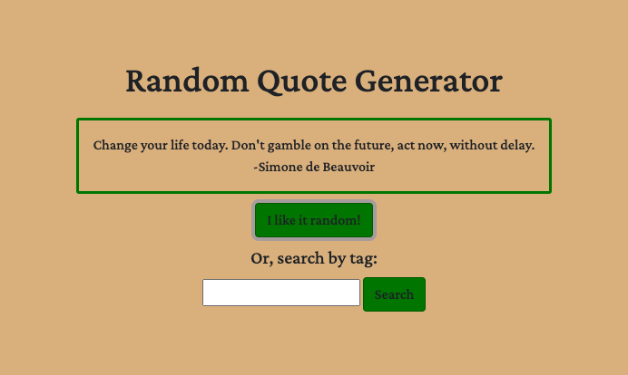

# Random Quote Generator

This practice web page sends a fetch request to a quotes API, and it can either return a random quote, or a quote that matches a user-provided tag.

Created with JavaScript, HTML/CSS, and DOM manipulation.

